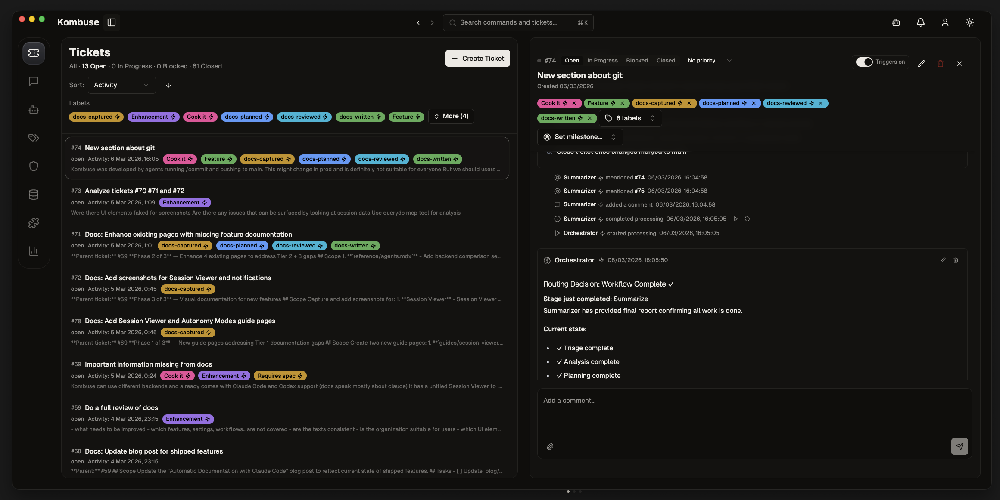

# Kombuse

Local-first agent management and issue tracking.



Kombuse is a desktop app and web UI for orchestrating AI coding agents with a private issue tracker. It ships as an MCP server and integrates natively with Claude Code CLI and OpenAI Codex — no API keys, no cloud setup. Everything runs on SQLite on your machine.

## Why Kombuse

- **Zero config.** Kombuse detects your Claude Code and Codex installations automatically. Install it, run it, you're working.
- **Private by default.** Tickets, agents, chat history, file attachments — all in a single SQLite file on your filesystem. Works offline.
- **Agents with project context.** Full-text search across all tickets, comments, and decisions — available to both you and your agents via MCP. Agents query your project history before acting. The more you use Kombuse, the more useful your agents become.
- **Use it anywhere.** Run it as a desktop app, in the browser, or access your tickets from Claude Code and Cursor via MCP. Your workflow stays consistent across apps and tools you already use.
- **Extensible.** Swap backends per agent, create custom labels and triggers, write or import plugins that bundle agents with their permissions and automation rules. Opinionated defaults, but every layer is customizable.

## Features

- **Agent editor** — system prompts with template variables, per-agent backend selection (Claude Code, Codex), enable/disable toggles
- **Event-driven triggers** — agents fire on ticket events (`ticket.created`, `comment.added`, `label.added`), with conditions and priority ordering
- **Permissions and approval workflow** — resource and tool permissions with glob patterns, scope levels, manual approval for sensitive actions
- **Private ticket system** — statuses, priorities, labels, milestones, threaded comments, full-text search, `@mention` and `#ticket` references
- **Chat sessions** — talk to agents directly or via ticket comments, persistent history, streaming responses, permission prompts inline
- **MCP server** — 30+ tools, works from Claude Code, Cursor, or any MCP-compatible client
- **Plugin system** — export and share agent configurations, triggers, and permissions as installable packages

## Getting started

Download from [Releases](https://github.com/KombuseLabs/kombuse/releases), or build from source:

```bash
git clone https://github.com/KombuseLabs/kombuse.git
cd kombuse
bun install
bun run dev
```

Auto-detects Claude Code and Codex if installed. No configuration needed.


## Tech Stack

Bun, Node >= 18, TypeScript 5.9, React 19, React Router 7, Vite 7, Tailwind CSS 4, shadcn/ui + Radix, Fastify 5, SQLite, Electron, Turborepo, Vitest

## Troubleshooting

### Electron failed to install correctly

If `bun run dev` fails with `Electron failed to install correctly, please delete node_modules/electron and try installing again`, re-run the Electron install script:

```bash
cd apps/desktop/node_modules/electron
node install.js
cd -
```

This re-downloads the Electron binary. If the download stalls or fails, check your network connection and retry.

If the issue persists, delete the cached binary and reinstall:

```bash
rm -rf apps/desktop/node_modules/electron
bun install
```

## Documentation

[kombuse.dev](https://kombuse.dev)

## License

[MIT](LICENSE)
