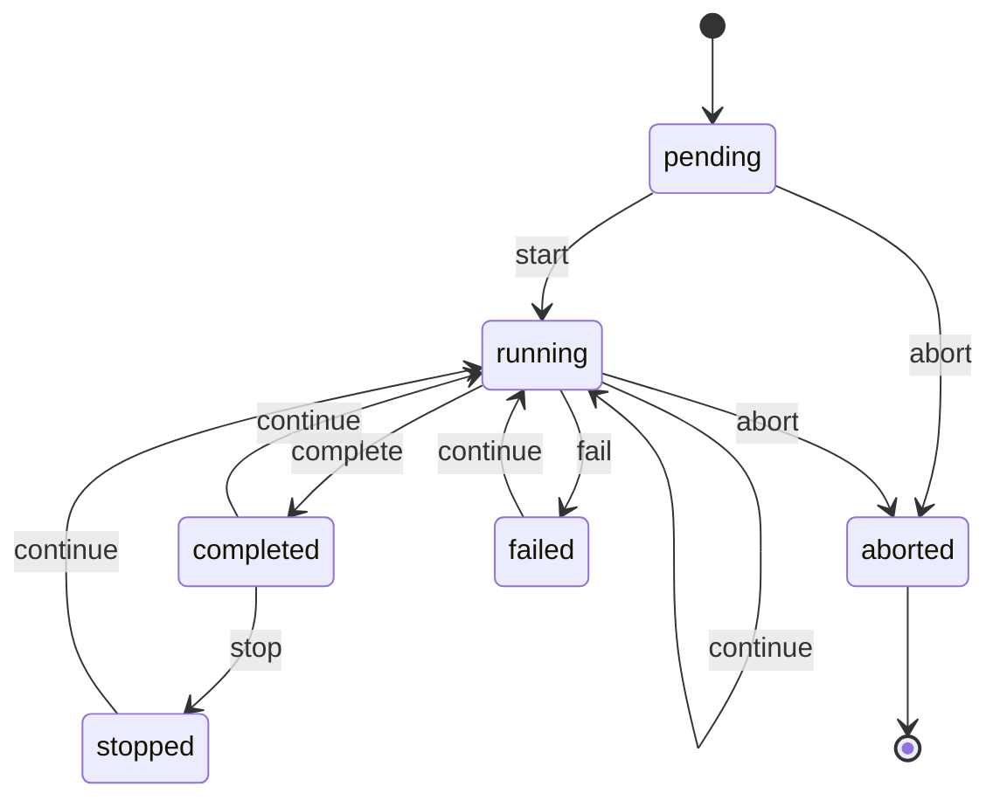
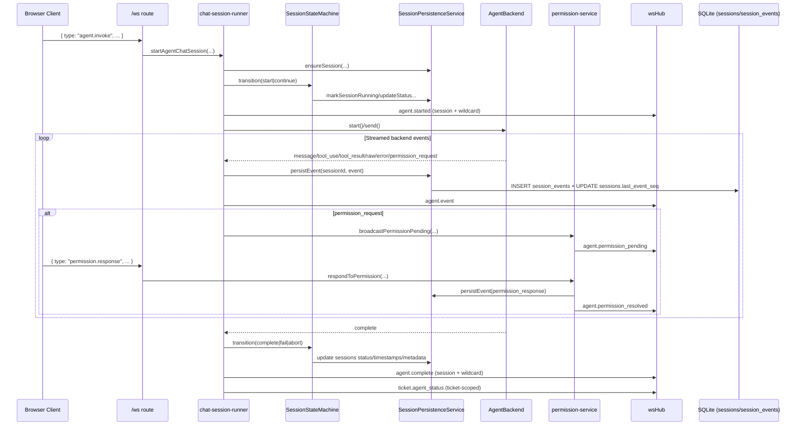
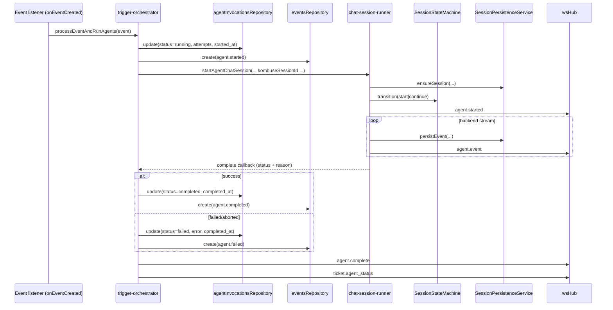

# Agent Lifecycle Architecture

This document is the canonical lifecycle spec for agent execution in Kombuse.

Scope:
- Agent backend process lifecycle (emitted/listened events)
- Persisted lifecycle state in `sessions`, `session_events`, and `agent_invocations`
- WebSocket lifecycle stream (`agent.started`, `agent.event`, `agent.complete`, permission events, `ticket.agent_status`)

## Lifecycle State Planes

| Plane | Owner | Purpose | Persisted storage |
|------|-------|---------|-------------------|
| Backend process lifecycle | `AgentBackend` implementations + `activeBackends` runtime map | Live process state and streamed tool/message events | Not directly persisted as a single state; stream events go to `session_events` |
| Session lifecycle | `SessionStateMachine` + `SessionPersistenceService` | Durable chat session status and terminal metadata | `sessions` + `session_events` |
| Trigger invocation lifecycle | `trigger-orchestrator` + invocation updates | Scheduler/audit status for trigger runs | `agent_invocations` (+ audit events in `events`) |

## Session State Machine (Canonical)

Source of truth: `packages/services/src/session-state-machine.ts`.

### Transition Matrix

`—` means invalid transition.

| From state | `start` | `complete` | `fail` | `abort` | `stop` | `continue` |
|------------|---------|------------|--------|---------|--------|------------|
| `pending` | `running` | — | — | `aborted` | — | — |
| `running` | — | `completed` | `failed` | `aborted` | — | `running` |
| `completed` | — | — | — | — | `stopped` | `running` |
| `failed` | — | — | — | — | — | `running` |
| `aborted` | — | — | — | — | — | — |
| `stopped` | — | — | — | — | — | `running` |

### Mermaid State Diagram



### ASCII State Diagram

```text
                         +--------------------- continue ----------------------+
                         |                                                     |
[pending] --start--> [running] --complete--> [completed] --stop--> [stopped] |
    |                   |  ^                    |  ^                           |
    |                   |  |                    |  +-------- continue ---------+
    |                   |  +------ continue ----+
    |                   +--fail--> [failed] --continue-------------------------+
    +------abort--------------------------------------------------> [aborted]

[aborted] has no outbound transitions.
```

## Sequence: User-Initiated WebSocket Flow

### Mermaid



### ASCII

```text
Client -> /ws -> chat-session-runner -> SessionStateMachine -> SessionPersistence -> DB
                                    \-> AgentBackend

1) agent.invoke enters /ws
2) runner ensures session + starts/continues state-machine lifecycle
3) runner emits agent.started
4) backend streams events
5) runner persists each stream event to session_events and emits agent.event
6) permission_request path:
   - broadcast agent.permission_pending
   - receive permission.response
   - persist permission_response
   - broadcast agent.permission_resolved
7) backend completes
8) runner applies complete/fail/abort transition
9) runner emits agent.complete and ticket.agent_status
```

## Sequence: Trigger-Orchestrated Flow

### Mermaid



### ASCII

```text
Event bus -> trigger-orchestrator
  -> agent_invocations.status = running
  -> events(agent.started)
  -> startAgentChatSession(...)
      -> sessions/session_events lifecycle (same runner path as user invoke)
  <- complete callback
  -> agent_invocations.status = completed|failed
  -> events(agent.completed|agent.failed)
  -> websocket agent.complete + ticket.agent_status
```

## Emitted / Listened / Persisted Mapping

### Backend Stream + Lifecycle Events

| Event | Emitted | Listened | Persisted | Storage location |
|------|---------|----------|-----------|------------------|
| `message` | Backend (`backend.subscribe`) | `chat-session-runner` | Yes | `session_events` row (`event_type='message'`), `sessions.last_event_seq` |
| `tool_use` | Backend | `chat-session-runner` | Yes | `session_events` (`event_type='tool_use'`), `sessions.last_event_seq` |
| `tool_result` | Backend | `chat-session-runner` | Yes | `session_events` (`event_type='tool_result'`), `sessions.last_event_seq` |
| `permission_request` | Backend | `chat-session-runner` (`handlePermissionRequest`) | Yes | `session_events` (`event_type='permission_request'`), `sessions.last_event_seq` |
| `permission_response` | `permission-service` when WS `permission.response` is handled | Backend via `respondToPermission(...)` + clients via `agent.permission_resolved` | Yes | `session_events` (`event_type='permission_response'`) |
| `raw` | Backend | `chat-session-runner` | Yes | `session_events` (`event_type='raw'`), `sessions.last_event_seq` |
| `error` | Backend | `chat-session-runner` | Yes | `session_events` (`event_type='error'`), plus `sessions.status='failed'` transition on terminal failure |
| `complete` | Backend | `chat-session-runner` completion handlers | Yes (via transition side effects, not as normal `session_events` row) | `sessions.status`, terminal timestamps (`completed_at` / `failed_at` / `aborted_at`), `sessions.backend_session_id`, optional `agent_invocations.status` update |

### WebSocket Lifecycle Messages

| Message | Emitted | Listened | Persisted | Storage location |
|---------|---------|----------|-----------|------------------|
| `agent.started` | `websocket/routes.ts` and `trigger-orchestrator.ts` | UI (`AppProvider`) and any `session:{id}` / `*` subscribers | Trigger path only | `events` (`event_type='agent.started'`) for trigger path; no dedicated websocket table |
| `agent.event` | `websocket/routes.ts` and `trigger-orchestrator.ts` | Session subscribers + origin socket | Indirectly yes | Underlying source events are in `session_events` |
| `agent.complete` | `websocket/routes.ts`, `trigger-orchestrator.ts`, `backend-registry.ts` | UI removes active session/pending permissions | Yes | `sessions` terminal status fields; trigger path also writes `agent_invocations` + `events` (`agent.completed`/`agent.failed`) |
| `agent.permission_pending` | `permission-service.ts` | UI permission queue + session/wildcard subscribers | Indirectly yes | Request event persisted in `session_events`; pending queue in runtime map (`serverPendingPermissions`) |
| `agent.permission_resolved` | `permission-service.ts` | UI permission queue + session/wildcard subscribers | Yes | `session_events` (`permission_response`) |
| `ticket.agent_status` | `backend-registry.ts` | UI ticket status map | Derived only (no row) | Computed from `sessions` + in-memory `activeBackends`; broadcast only |

## Database Storage Map

| Database table | Stores | Main writers |
|----------------|--------|--------------|
| `sessions` | Durable session lifecycle (`status`, timestamps, metadata, backend ids) | `SessionStateMachine` via `SessionPersistenceService`, cleanup paths in `backend-registry` |
| `session_events` | Ordered event stream for a session (`seq`, `event_type`, `payload`) | `SessionPersistenceService.persistEvent(...)` from `chat-session-runner` and `permission-service` |
| `agent_invocations` | Trigger execution lifecycle (`pending/running/completed/failed`, attempts, errors) | `trigger-orchestrator`, plus state-machine invocation callbacks for continuation flows |
| `events` | Audit/timeline domain events (`agent.started`, `agent.completed`, `agent.failed`, ticket/comment events) | `trigger-orchestrator` (agent lifecycle domain events) and repository-level event creation |
