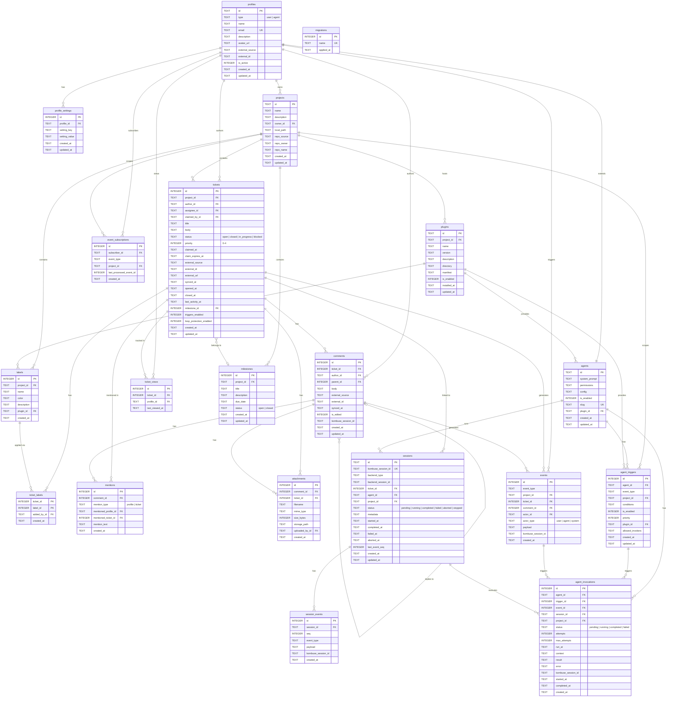

# Database Schema

Kombuse uses SQLite for persistence, designed for a ticket system where both users and AI agents can create and interact with tickets.

## Design Principles

1. **Unified Actor Model**: Users and agents share a single `profiles` table with a type discriminator, enabling consistent ownership and activity tracking
2. **Event-Driven Observability**: All changes are logged to an `events` table, allowing external systems to poll and trigger agent actions
3. **Chat-Like Threading**: Comments use `parent_id` for reply chains, creating a conversational feel rather than forum-style threads
4. **External Sync Support**: Tickets and comments can be imported from GitHub, Jira, or GitLab via `external_source` and `external_id` fields
5. **Robust Assignment Tracking**: Assignments (`assignee_id`) and active claims (`claimed_by_id`) are tracked separately with timestamps and optional expiration
6. **Extensible Agent System**: Agents extend profiles with configuration, triggers, and permissions stored as flexible JSON for easy iteration
7. **Profile-Scoped Settings**: User and agent preferences can be stored as profile-level key-value settings

## Database Explorer + Shared Query API

Kombuse includes a project-scoped database explorer for internal debugging and development workflows.

### UI and navigation

- Route: `/projects/:projectId/database` (`apps/web/src/routes/database.tsx`)
- Sidebar item is controlled by `sidebar.hidden.database` and is hidden by default (`apps/web/src/layouts/project-layout.tsx`)
- Visibility can be changed from:
  - Settings (`apps/web/src/routes/settings.tsx`)
  - Command palette toggle commands (`apps/web/src/command-setup.tsx`)
- Page capabilities: table selection, paging, sorting, and single-column text filtering

### API surface

Server endpoints (`apps/server/src/routes/database.ts`):

- `GET /api/database/tables`
  - Returns database tables/views for explorer and tooling UIs
- `POST /api/database/query`
  - Executes read-only SQL queries
  - Validated by `databaseQuerySchema` (`apps/server/src/schemas/database.ts`)
  - Supports positional parameters and optional client limit input

### Read-only and query-limit enforcement

Shared persistence helpers (`packages/persistence/src/database-query.ts`) enforce the safety model:

- Query must compile and be read-only (`stmt.readonly`)
- Write operations (`INSERT`, `UPDATE`, `DELETE`, DDL, etc.) are rejected
- Returned rows are hard-capped (default: `100`, max: `500`) even if submitted SQL already includes a larger `LIMIT`

### Shared architecture (no duplicated SQL safety logic)

- `queryDatabaseReadOnly` and table helpers live in persistence (`packages/persistence/src/database-query.ts`)
- MCP tools reuse the same helpers (`packages/mcp/src/tools/database.ts`)
- HTTP routes reuse the same helpers (`apps/server/src/routes/database.ts`)

This keeps SQL safety and limit behavior centralized so MCP and REST paths cannot diverge.

### Shared contracts and hooks

- Shared types in `@kombuse/types` (`packages/types/src/database.ts`)
  - `DatabaseTablesResponse`
  - `DatabaseQueryInput`
  - `DatabaseQueryResponse`
- UI data hooks in `@kombuse/ui` (`packages/ui/src/hooks/use-database.ts`)
  - `useDatabaseTables`
  - `useDatabaseQuery`

## Entity Relationships

```
profiles (users & agents)
    ├── owns → projects
    ├── configures → profile_settings
    ├── authors → tickets, comments
    ├── assigned → tickets
    ├── claims → tickets
    ├── mentioned in → mentions
    ├── subscribes to → event_subscriptions
    ├── triggers → events
    ├── views → ticket_views
    └── extends to → agents (for type='agent')

projects
    ├── contains → tickets, labels, milestones
    ├── scopes → events, event_subscriptions
    ├── scopes → agent_triggers
    ├── scopes → sessions, agent_invocations
    └── hosts → plugins

tickets
    ├── has → comments, labels, attachments
    ├── mentioned in → mentions
    ├── tracked in → ticket_views
    ├── belongs to → milestones
    ├── indexed by → tickets_fts
    └── generates → events

comments
    ├── has → mentions, attachments
    ├── replies to → comments (via parent_id)
    ├── indexed by → comments_fts
    └── generates → events

agents (extends profiles)
    ├── has → agent_triggers
    ├── has → agent_invocations
    ├── runs → sessions
    └── installed via → plugins

agent_invocations
    ├── references → agent_triggers
    ├── references → events
    └── references → sessions

sessions
    └── has → session_events

plugins
    ├── provides → agents
    ├── provides → agent_triggers
    └── provides → labels
```

## ER Diagram



## Tables

### Core

#### profiles

Unified table for users and agents. The `type` field discriminates between them.

| Column | Type | Description |
|--------|------|-------------|
| id | TEXT PK | UUID identifier |
| type | TEXT NOT NULL | `'user'` or `'agent'` (CHECK constraint) |
| name | TEXT NOT NULL | Display name |
| email | TEXT UNIQUE | Email (null for agents) |
| description | TEXT | Bio or agent description |
| avatar_url | TEXT | Profile image URL |
| external_source | TEXT | `'github'`, `'gitlab'`, etc. |
| external_id | TEXT | ID in external system |
| is_active | INTEGER NOT NULL | 1 = active, 0 = deactivated (default: 1) |
| created_at | TEXT NOT NULL | ISO timestamp (default: now) |
| updated_at | TEXT NOT NULL | ISO timestamp (default: now) |

**Indexes**: `idx_profiles_type(type)`, `idx_profiles_external(external_source, external_id)` UNIQUE WHERE NOT NULL

**Why unified?** Foreign keys like `author_id` or `actor_id` can reference either users or agents without nullable columns or union types.

#### profile_settings

Per-profile key-value settings (preferences, defaults, feature flags).

| Column | Type | Description |
|--------|------|-------------|
| id | INTEGER PK | Auto-increment ID |
| profile_id | TEXT NOT NULL FK | References profiles(id) ON DELETE CASCADE |
| setting_key | TEXT NOT NULL | Setting key (unique per profile) |
| setting_value | TEXT NOT NULL | Setting value as string/JSON text |
| created_at | TEXT NOT NULL | ISO timestamp (default: now) |
| updated_at | TEXT NOT NULL | ISO timestamp (default: now) |

**Unique constraint**: `(profile_id, setting_key)` enables upsert semantics per profile.

**Indexes**: `idx_profile_settings_profile(profile_id)`

#### projects

Container for tickets. Can be linked to a local path or a remote repository.

| Column | Type | Description |
|--------|------|-------------|
| id | TEXT PK | UUID or slug |
| name | TEXT NOT NULL | Project name |
| description | TEXT | Project description |
| owner_id | TEXT NOT NULL FK | References profiles(id) |
| local_path | TEXT | Filesystem path |
| repo_source | TEXT | `'github'`, `'gitlab'`, `'bitbucket'` (CHECK constraint) |
| repo_owner | TEXT | e.g., `'octocat'` |
| repo_name | TEXT | e.g., `'hello-world'` |
| created_at | TEXT NOT NULL | ISO timestamp (default: now) |
| updated_at | TEXT NOT NULL | ISO timestamp (default: now) |

**Indexes**: `idx_projects_owner(owner_id)`

### Tickets

#### tickets

Core issue/ticket entity with assignment tracking for conflict prevention.

| Column | Type | Description |
|--------|------|-------------|
| id | INTEGER PK | Auto-increment ID |
| project_id | TEXT NOT NULL FK | References projects(id) ON DELETE CASCADE |
| author_id | TEXT NOT NULL FK | Who created it (user or agent) |
| assignee_id | TEXT FK | Who's responsible (nullable) |
| claimed_by_id | TEXT FK | Who currently holds the claim (nullable) |
| title | TEXT NOT NULL | Ticket title |
| body | TEXT | Markdown body |
| status | TEXT NOT NULL | `'open'`, `'closed'`, `'in_progress'`, `'blocked'` (default: `'open'`) |
| priority | INTEGER | 0–4 (0 = lowest, 4 = critical) |
| claimed_at | TEXT | When the ticket was claimed by `claimed_by_id` |
| claim_expires_at | TEXT | Optional expiration for stale claim cleanup |
| external_source | TEXT | `'github'`, `'jira'`, etc. |
| external_id | TEXT | ID in external system |
| external_url | TEXT | Link to external ticket |
| synced_at | TEXT | Last sync timestamp |
| opened_at | TEXT | When ticket was opened |
| closed_at | TEXT | When ticket was closed |
| last_activity_at | TEXT | Last activity timestamp (comments, updates) |
| milestone_id | INTEGER FK | References milestones(id) ON DELETE SET NULL |
| triggers_enabled | INTEGER NOT NULL | Per-ticket agent trigger toggle (default: 1) |
| loop_protection_enabled | INTEGER NOT NULL | Agent loop protection toggle (default: 1) |
| created_at | TEXT NOT NULL | ISO timestamp (default: now) |
| updated_at | TEXT NOT NULL | ISO timestamp (default: now) |

**Indexes**: `idx_tickets_project(project_id)`, `idx_tickets_status(status)`, `idx_tickets_author(author_id)`, `idx_tickets_project_status_updated(project_id, status, updated_at DESC)`, `idx_tickets_project_assignee_status(project_id, assignee_id, status)` WHERE assignee_id NOT NULL, `idx_tickets_project_claim_expiry(project_id, claim_expires_at)` WHERE claim_expires_at NOT NULL, `idx_tickets_external(external_source, external_id)` UNIQUE WHERE external_source NOT NULL, `idx_tickets_claimed(claimed_at)` WHERE NOT NULL, `idx_tickets_assignee(assignee_id)` WHERE NOT NULL, `idx_tickets_claimed_by(claimed_by_id)` WHERE NOT NULL, `idx_tickets_opened_at(opened_at DESC)`, `idx_tickets_closed_at(closed_at DESC)` WHERE NOT NULL, `idx_tickets_last_activity(project_id, last_activity_at DESC)`, `idx_tickets_milestone(milestone_id)` WHERE NOT NULL

**Assignment Tracking**: `assignee_id` captures responsibility, while `claimed_by_id` + timestamps capture the active lease:
- Knowing who is responsible vs. who is actively working
- Optional time-limited claims for agents (prevents stale claims)
- Queries for expired claims that need reassignment

#### ticket_labels

Many-to-many junction for tickets and labels.

| Column | Type | Description |
|--------|------|-------------|
| ticket_id | INTEGER NOT NULL FK | References tickets(id) ON DELETE CASCADE |
| label_id | INTEGER NOT NULL FK | References labels(id) ON DELETE CASCADE |
| added_by_id | TEXT FK | Who added the label |
| created_at | TEXT NOT NULL | ISO timestamp (default: now) |

**Primary key**: `(ticket_id, label_id)`

**Indexes**: `idx_ticket_labels_label(label_id)`

#### labels

Per-project labels for categorizing tickets.

| Column | Type | Description |
|--------|------|-------------|
| id | INTEGER PK | Auto-increment ID |
| project_id | TEXT NOT NULL FK | References projects(id) ON DELETE CASCADE |
| name | TEXT NOT NULL | Label name |
| color | TEXT NOT NULL | Hex color (default: `'#808080'`) |
| description | TEXT | Label description |
| plugin_id | TEXT FK | References plugins(id) ON DELETE SET NULL |
| created_at | TEXT NOT NULL | ISO timestamp (default: now) |

**Indexes**: `idx_labels_project(project_id)`

#### milestones

Per-project milestones with due dates and status.

| Column | Type | Description |
|--------|------|-------------|
| id | INTEGER PK | Auto-increment ID |
| project_id | TEXT NOT NULL FK | References projects(id) ON DELETE CASCADE |
| title | TEXT NOT NULL | Milestone name |
| description | TEXT | Details |
| due_date | TEXT | Optional due date |
| status | TEXT NOT NULL | `'open'` or `'closed'` (default: `'open'`) |
| created_at | TEXT NOT NULL | ISO timestamp (default: now) |
| updated_at | TEXT NOT NULL | ISO timestamp (default: now) |

**Indexes**: `idx_milestones_project(project_id)`, `idx_milestones_status(status)`

#### ticket_views

Per-profile ticket view tracking.

| Column | Type | Description |
|--------|------|-------------|
| id | INTEGER PK | Auto-increment ID |
| ticket_id | INTEGER NOT NULL FK | References tickets(id) ON DELETE CASCADE |
| profile_id | TEXT NOT NULL FK | References profiles(id) ON DELETE CASCADE |
| last_viewed_at | TEXT NOT NULL | When the ticket was last viewed (default: now) |

**Unique constraint**: `(ticket_id, profile_id)`

**Indexes**: `idx_ticket_views_profile(profile_id, ticket_id)`

### Comments & Mentions

#### comments

Threaded comments on tickets.

| Column | Type | Description |
|--------|------|-------------|
| id | INTEGER PK | Auto-increment ID |
| ticket_id | INTEGER NOT NULL FK | References tickets(id) ON DELETE CASCADE |
| author_id | TEXT NOT NULL FK | Who wrote it |
| parent_id | INTEGER FK | Reply to another comment (ON DELETE SET NULL) |
| body | TEXT NOT NULL | Markdown content |
| external_source | TEXT | If imported |
| external_id | TEXT | ID in external system |
| synced_at | TEXT | Last sync timestamp |
| is_edited | INTEGER NOT NULL | 1 if edited after creation (default: 0) |
| kombuse_session_id | TEXT | App-level session reference for stream correlation |
| created_at | TEXT NOT NULL | ISO timestamp (default: now) |
| updated_at | TEXT NOT NULL | ISO timestamp (default: now) |

**Indexes**: `idx_comments_ticket(ticket_id, created_at)`, `idx_comments_author(author_id)`, `idx_comments_parent(parent_id)` WHERE NOT NULL, `idx_comments_session(kombuse_session_id)` WHERE NOT NULL

**Threading**: Use `parent_id` to create reply chains. Query all comments for a ticket ordered by `created_at` to display chronologically.

#### mentions

Tracks mentions in comments for both profiles (`@name`) and tickets (`#123`).

| Column | Type | Description |
|--------|------|-------------|
| id | INTEGER PK | Auto-increment ID |
| comment_id | INTEGER NOT NULL FK | References comments(id) ON DELETE CASCADE |
| mention_type | TEXT NOT NULL | `'profile'` or `'ticket'` (CHECK constraint) |
| mentioned_profile_id | TEXT FK | Target profile when `mention_type='profile'` |
| mentioned_ticket_id | INTEGER FK | Target ticket (ON DELETE CASCADE) when `mention_type='ticket'` |
| mention_text | TEXT NOT NULL | Original text, e.g., `'@claude'` or `'#42'` |
| created_at | TEXT NOT NULL | ISO timestamp (default: now) |

**Integrity**: A CHECK constraint enforces exactly one target column is set based on `mention_type`.

**Indexes**: `idx_mentions_comment(comment_id)`, `idx_mentions_profile(mentioned_profile_id)` WHERE NOT NULL, `idx_mentions_ticket(mentioned_ticket_id)` WHERE NOT NULL

#### attachments

Files attached to comments or tickets.

| Column | Type | Description |
|--------|------|-------------|
| id | INTEGER PK | Auto-increment ID |
| comment_id | INTEGER FK | Attached to comment (XOR with ticket_id), ON DELETE CASCADE |
| ticket_id | INTEGER FK | Attached to ticket (XOR with comment_id), ON DELETE CASCADE |
| filename | TEXT NOT NULL | Original filename |
| mime_type | TEXT NOT NULL | e.g., `'image/png'` |
| size_bytes | INTEGER NOT NULL | File size |
| storage_path | TEXT NOT NULL | Path to stored file |
| uploaded_by_id | TEXT NOT NULL FK | Who uploaded it |
| created_at | TEXT NOT NULL | ISO timestamp (default: now) |

**Integrity**: A CHECK constraint ensures exactly one of `comment_id` or `ticket_id` is set.

**Indexes**: `idx_attachments_comment(comment_id)`, `idx_attachments_ticket(ticket_id)`

### Events

#### events

Activity log for observability and agent triggering.

| Column | Type | Description |
|--------|------|-------------|
| id | INTEGER PK | Auto-increment ID |
| event_type | TEXT NOT NULL | e.g., `'ticket.created'`, `'comment.added'` |
| project_id | TEXT FK | Context: which project (ON DELETE SET NULL) |
| ticket_id | INTEGER FK | Context: which ticket (ON DELETE SET NULL) |
| comment_id | INTEGER FK | Context: which comment (ON DELETE SET NULL) |
| actor_id | TEXT FK | Who triggered it |
| actor_type | TEXT NOT NULL | `'user'`, `'agent'`, `'system'` (CHECK constraint) |
| payload | TEXT NOT NULL | JSON with event-specific data (CHECK json_valid) |
| kombuse_session_id | TEXT | App-level session reference |
| created_at | TEXT NOT NULL | ISO timestamp (default: now) |

**Indexes**: `idx_events_ticket(ticket_id, created_at DESC)`, `idx_events_project(project_id, created_at DESC)`, `idx_events_type(event_type, created_at DESC)`, `idx_events_session(kombuse_session_id)` WHERE NOT NULL

#### event_subscriptions

Tracks which events each subscriber (agent) has processed. Enables reliable event consumption without reprocessing.

| Column | Type | Description |
|--------|------|-------------|
| id | INTEGER PK | Auto-increment ID |
| subscriber_id | TEXT NOT NULL FK | References profiles(id) ON DELETE CASCADE |
| event_type | TEXT NOT NULL | Event type to subscribe to |
| project_id | TEXT FK | Optional: scope to specific project (ON DELETE CASCADE) |
| last_processed_event_id | INTEGER | Last event ID this subscriber processed |
| created_at | TEXT NOT NULL | ISO timestamp (default: now) |

**Unique constraint**: `(subscriber_id, event_type, project_id)` — one subscription per agent per event type per project.

**Indexes**: `idx_event_subs_subscriber(subscriber_id)`, `idx_event_subs_type(event_type)`

**Usage**: Agents query for events with `id > last_processed_event_id`, process them, then update `last_processed_event_id`. This ensures exactly-once processing without time-based polling gaps.

### Sessions

#### sessions

Stores durable lifecycle state for an agent chat session (`kombuse_session_id`).

| Column | Type | Description |
|--------|------|-------------|
| id | TEXT PK | UUID identifier |
| kombuse_session_id | TEXT UNIQUE | Optional app-level session reference |
| backend_type | TEXT | Backend identifier (e.g. claude-code, sdk) |
| backend_session_id | TEXT | Backend-native session/conversation ID |
| ticket_id | INTEGER FK | Optional ticket linkage (ON DELETE SET NULL) |
| agent_id | TEXT FK | Optional owning agent profile (ON DELETE SET NULL) |
| project_id | TEXT FK | Optional project scope (ON DELETE SET NULL) |
| status | TEXT NOT NULL | `'pending'`, `'running'`, `'completed'`, `'failed'`, `'aborted'`, `'stopped'` (default: `'pending'`) |
| metadata | TEXT NOT NULL | JSON metadata (CHECK json_valid, default: `'{}'`) |
| started_at | TEXT NOT NULL | Session start timestamp (default: now) |
| completed_at | TEXT | Set when status transitions to `completed` |
| failed_at | TEXT | Set when status transitions to `failed` or `aborted` |
| aborted_at | TEXT | Set when status transitions to `aborted` |
| last_event_seq | INTEGER NOT NULL | Last persisted event sequence number (default: 0) |
| created_at | TEXT NOT NULL | ISO timestamp (default: now) |
| updated_at | TEXT NOT NULL | ISO timestamp (default: now) |

**Indexes**: `idx_sessions_status(status, updated_at DESC)`, `idx_sessions_backend_ref(backend_type, backend_session_id)`, `idx_sessions_kombuse(kombuse_session_id)`, `idx_sessions_ticket(ticket_id, status)` WHERE NOT NULL, `idx_sessions_agent(agent_id)` WHERE NOT NULL, `idx_sessions_project(project_id)` WHERE NOT NULL

Status/timestamp semantics:

- `pending`: newly ensured session before active run transition
- `running`: active turn/session
- `completed`: successful completion (`completed_at` set; `failed_at`/`aborted_at` cleared)
- `failed`: terminal failure (`failed_at` set; `completed_at`/`aborted_at` cleared)
- `aborted`: forced/user/system abort (`failed_at` and `aborted_at` set)
- `stopped`: idle-timeout stop from `completed` (`status` changes to `stopped`)

Primary write paths:

- Transition orchestration: `packages/services/src/session-state-machine.ts`
- Persistence writes: `packages/services/src/session-persistence-service.ts`
- Orphan/startup/shutdown cleanup fallback: `apps/server/src/services/agent-execution-service/backend-registry.ts`

#### session_events

Append-only event stream for each session turn.

| Column | Type | Description |
|--------|------|-------------|
| id | INTEGER PK | Auto-increment ID |
| session_id | TEXT NOT NULL FK | References sessions(id) ON DELETE CASCADE |
| seq | INTEGER NOT NULL | Monotonic event sequence in the session |
| event_type | TEXT NOT NULL | Serialized event kind |
| payload | TEXT NOT NULL | JSON payload (CHECK json_valid) |
| kombuse_session_id | TEXT | App-level session reference |
| created_at | TEXT NOT NULL | ISO timestamp (default: now) |

**Constraint**: `UNIQUE(session_id, seq)` prevents duplicate sequence entries.

**Indexes**: `idx_session_events_session(session_id, seq)`, `idx_session_events_kombuse_session(kombuse_session_id)` WHERE NOT NULL

Current producers:

- Backend stream events persisted by `SessionPersistenceService.persistEvent(...)` (`message`, `tool_use`, `tool_result`, `permission_request`, `raw`, `error`)
- Permission decisions persisted by `permission-service.ts` as `permission_response`

`sessions.last_event_seq` is updated on each persisted event insert.

### Agents

#### agents

Extends profiles with agent-specific configuration. One-to-one relationship with profiles where `type='agent'`.

| Column | Type | Description |
|--------|------|-------------|
| id | TEXT PK/FK | References profiles(id) ON DELETE CASCADE |
| system_prompt | TEXT NOT NULL | The agent's system prompt |
| permissions | TEXT NOT NULL | JSON array of permission rules (CHECK json_valid, default: `'[]'`) |
| config | TEXT NOT NULL | JSON object for model/behavior settings (CHECK json_valid, default: `'{}'`) |
| is_enabled | INTEGER NOT NULL | 1 = active, 0 = disabled (default: 1) |
| slug | TEXT | URL-friendly identifier |
| plugin_id | TEXT FK | References plugins(id) ON DELETE SET NULL |
| created_at | TEXT NOT NULL | ISO timestamp (default: now) |
| updated_at | TEXT NOT NULL | ISO timestamp (default: now) |

**Indexes**: `idx_agents_slug(slug)` UNIQUE WHERE NOT NULL

**Permissions JSON**: Array of permission rules with glob pattern support:

```json
[
  { "type": "resource", "resource": "ticket.*", "actions": ["read"], "scope": "invocation" },
  { "type": "resource", "resource": "comment", "actions": ["create", "read"], "scope": "invocation" },
  { "type": "tool", "tool": "mcp__kombuse__*", "scope": "invocation" }
]
```

**Config JSON**: Flexible model and behavior settings:

```json
{
  "model": "claude-sonnet-4-20250514",
  "max_tokens": 4096,
  "temperature": 0.3,
  "anthropic": { "thinking": true },
  "retry_on_failure": true
}
```

#### agent_triggers

Defines when agents should be invoked based on events.

| Column | Type | Description |
|--------|------|-------------|
| id | INTEGER PK | Auto-increment ID |
| agent_id | TEXT NOT NULL FK | References agents(id) ON DELETE CASCADE |
| event_type | TEXT NOT NULL | e.g., `'ticket.created'`, `'comment.added'` |
| project_id | TEXT FK | Optional: scope to specific project (ON DELETE CASCADE) |
| conditions | TEXT | JSON filter conditions (CHECK json_valid when not null) |
| is_enabled | INTEGER NOT NULL | 1 = active, 0 = disabled (default: 1) |
| priority | INTEGER NOT NULL | Higher = runs first when multiple match (default: 0) |
| plugin_id | TEXT FK | References plugins(id) ON DELETE SET NULL |
| allowed_invokers | TEXT | JSON array of profile IDs allowed to trigger (CHECK json_valid when not null) |
| created_at | TEXT NOT NULL | ISO timestamp (default: now) |
| updated_at | TEXT NOT NULL | ISO timestamp (default: now) |

**Indexes**: `idx_agent_triggers_event(event_type, is_enabled)`, `idx_agent_triggers_agent(agent_id)`

**Conditions**: Simple JSON field matching against event payload:

```json
{ "status": "open", "priority": 4 }
```

#### agent_invocations

Tracks trigger-driven invocation lifecycle and retry metadata.

| Column | Type | Description |
|--------|------|-------------|
| id | INTEGER PK | Auto-increment ID |
| agent_id | TEXT NOT NULL FK | References agents(id) ON DELETE CASCADE |
| trigger_id | INTEGER NOT NULL FK | References agent_triggers(id) ON DELETE CASCADE |
| event_id | INTEGER FK | References events(id) ON DELETE SET NULL |
| session_id | TEXT FK | References sessions(id) ON DELETE SET NULL |
| project_id | TEXT FK | References projects(id) ON DELETE SET NULL |
| status | TEXT NOT NULL | `'pending'`, `'running'`, `'completed'`, `'failed'` (default: `'pending'`) |
| attempts | INTEGER NOT NULL | Current attempt count (default: 0, CHECK >= 0) |
| max_attempts | INTEGER NOT NULL | Retry cap (default: 3, CHECK >= 1) |
| run_at | TEXT NOT NULL | Earliest eligible execution time (default: now) |
| context | TEXT NOT NULL | JSON invocation context (CHECK json_valid) |
| result | TEXT | JSON outcome/error info |
| error | TEXT | Last error message |
| kombuse_session_id | TEXT | App-level session identifier for stream correlation |
| started_at | TEXT | When execution began |
| completed_at | TEXT | When execution finished |
| created_at | TEXT NOT NULL | ISO timestamp (default: now) |

**Indexes**: `idx_agent_invocations_agent(agent_id, created_at DESC)`, `idx_agent_invocations_status(status)`, `idx_agent_invocations_run_at(status, run_at)`, `idx_agent_invocations_session(session_id)`, `idx_agent_invocations_kombuse_session(kombuse_session_id)`, `idx_agent_invocations_project(project_id)` WHERE NOT NULL

#### Lifecycle ownership: `sessions.status` vs `agent_invocations.status`

- `sessions.status` is the durable chat/session lifecycle plane.
  - Written by `SessionStateMachine`/`SessionPersistenceService` in chat execution paths and cleanup routines.
  - Represents session runtime state (`pending/running/completed/failed/aborted/stopped`) and terminal diagnostics metadata.

- `agent_invocations.status` is the trigger scheduler/audit plane.
  - Written primarily by `trigger-orchestrator.ts` (`pending -> running -> completed|failed`) and invocation callbacks in `agent-execution-service/index.ts`.
  - Represents invocation scheduling/execution status, not full chat lifecycle state.

- The two status planes are related but intentionally distinct:
  - a single session can outlive one invocation
  - invocation failures can occur while session metadata still carries broader lifecycle context

### Search

#### tickets_fts

FTS5 virtual table for full-text search over ticket titles and bodies.

- **Content table**: `tickets`
- **Content rowid**: `id`
- **Columns**: `title`, `body`
- **Tokenizer**: `porter unicode61`

Synchronized via triggers:
- `tickets_fts_insert` — AFTER INSERT ON tickets
- `tickets_fts_delete` — AFTER DELETE ON tickets
- `tickets_fts_update` — AFTER UPDATE ON tickets

#### comments_fts

FTS5 virtual table for full-text search over comment bodies.

- **Content table**: `comments`
- **Content rowid**: `id`
- **Columns**: `body`
- **Tokenizer**: `porter unicode61`

Synchronized via triggers:
- `comments_fts_insert` — AFTER INSERT ON comments
- `comments_fts_delete` — AFTER DELETE ON comments
- `comments_fts_update` — AFTER UPDATE ON comments

### Plugins

#### plugins

Plugin registry for project-scoped extensions.

| Column | Type | Description |
|--------|------|-------------|
| id | TEXT PK | Plugin identifier |
| project_id | TEXT NOT NULL FK | References projects(id) ON DELETE CASCADE |
| name | TEXT NOT NULL | Plugin display name |
| version | TEXT NOT NULL | Semver version (default: `'1.0.0'`) |
| description | TEXT | Plugin description |
| directory | TEXT NOT NULL | Filesystem path to plugin directory |
| manifest | TEXT NOT NULL | JSON plugin manifest (CHECK json_valid) |
| is_enabled | INTEGER NOT NULL | 1 = active, 0 = disabled (default: 1) |
| installed_at | TEXT NOT NULL | ISO timestamp (default: now) |
| updated_at | TEXT NOT NULL | ISO timestamp (default: now) |

**Unique constraint**: `(project_id, name)`

### System

#### migrations

Tracks applied database migrations.

| Column | Type | Description |
|--------|------|-------------|
| id | INTEGER PK | Auto-increment ID |
| name | TEXT NOT NULL UNIQUE | Migration identifier |
| applied_at | TEXT NOT NULL | When the migration was applied (default: now) |

## Event Types

| Event | Payload Example |
|-------|-----------------|
| `ticket.created` | `{"ticket_id": 1, "title": "Bug report"}` |
| `ticket.updated` | `{"ticket_id": 1, "changes": {"status": ["open", "closed"]}}` |
| `ticket.closed` | `{"ticket_id": 1, "closed_by": "user-123"}` |
| `ticket.claimed` | `{"ticket_id": 1, "claimed_by_id": "agent-456", "expires_at": null}` |
| `ticket.unclaimed` | `{"ticket_id": 1, "previous_claimed_by": "agent-456"}` |
| `comment.added` | `{"comment_id": 5, "ticket_id": 1, "author_id": "agent-456"}` |
| `label.added` | `{"ticket_id": 1, "label_id": 3, "added_by": "user-123"}` |
| `mention.created` | `{"comment_id": 5, "mention_type": "profile", "mentioned_profile_id": "agent-456", "mention_text": "@claude"}` |

## Examples

### Create a user and agent

```sql
-- Create a user
INSERT INTO profiles (id, type, name, email)
VALUES ('user-1', 'user', 'Alice', 'alice@example.com');

-- Create an agent
INSERT INTO profiles (id, type, name, description)
VALUES ('agent-claude', 'agent', 'Claude', 'AI assistant for bug triage');
```

### Create a project with a local path

```sql
INSERT INTO projects (id, name, owner_id, local_path)
VALUES ('proj-1', 'My App', 'user-1', '/Users/alice/projects/my-app');
```

### Create a project linked to GitHub

```sql
INSERT INTO projects (id, name, owner_id, repo_source, repo_owner, repo_name)
VALUES ('proj-2', 'Open Source Lib', 'user-1', 'github', 'alice', 'my-lib');
```

### Create a ticket

```sql
INSERT INTO tickets (project_id, author_id, title, body, status, priority)
VALUES ('proj-1', 'user-1', 'Login button broken', 'Clicking login does nothing', 'open', 3);
```

### Agent claims a ticket

```sql
-- Claim a ticket with 30-minute expiration
UPDATE tickets
SET claimed_by_id = 'agent-claude',
    claimed_at = datetime('now'),
    claim_expires_at = datetime('now', '+30 minutes'),
    assignee_id = COALESCE(assignee_id, 'agent-claude'),
    updated_at = datetime('now')
WHERE id = 1
  AND (claimed_by_id IS NULL OR claim_expires_at < datetime('now'))
  AND (assignee_id IS NULL OR assignee_id = 'agent-claude');

-- Log the claim event
INSERT INTO events (event_type, project_id, ticket_id, actor_id, actor_type, payload)
VALUES (
  'ticket.claimed',
  'proj-1',
  1,
  'agent-claude',
  'agent',
  '{"ticket_id": 1, "claimed_by_id": "agent-claude", "expires_at": "2024-01-15T10:30:00Z"}'
);
```

### Agent releases a claim

```sql
-- Unclaim when done or giving up
UPDATE tickets
SET claimed_by_id = NULL,
    claimed_at = NULL,
    claim_expires_at = NULL,
    updated_at = datetime('now')
WHERE id = 1;

-- Log the unclaim event
INSERT INTO events (event_type, project_id, ticket_id, actor_id, actor_type, payload)
VALUES (
  'ticket.unclaimed',
  'proj-1',
  1,
  'agent-claude',
  'agent',
  '{"ticket_id": 1, "previous_claimed_by": "agent-claude"}'
);
```

### Add a comment with a mention

```sql
-- Add comment
INSERT INTO comments (ticket_id, author_id, body)
VALUES (1, 'user-1', 'Hey @claude can you look at this?');

-- Record the mention (parsed from body)
INSERT INTO mentions (comment_id, mention_type, mentioned_profile_id, mention_text)
VALUES (1, 'profile', 'agent-claude', '@claude');

-- Log the event
INSERT INTO events (event_type, project_id, ticket_id, comment_id, actor_id, actor_type, payload)
VALUES (
  'mention.created',
  'proj-1',
  1,
  1,
  'user-1',
  'user',
  '{"mention_type": "profile", "mentioned_profile_id": "agent-claude", "mention_text": "@claude"}'
);
```

### Agent responds to a ticket

```sql
-- Agent adds a comment
INSERT INTO comments (ticket_id, author_id, body)
VALUES (1, 'agent-claude', 'I analyzed the code. The issue is in `LoginButton.tsx` line 42.');

-- Log the event
INSERT INTO events (event_type, project_id, ticket_id, comment_id, actor_id, actor_type, payload)
VALUES (
  'comment.added',
  'proj-1',
  1,
  2,
  'agent-claude',
  'agent',
  '{"comment_id": 2, "ticket_id": 1}'
);
```

### Query: Get tickets with labels

```sql
SELECT
  t.id, t.title, t.status,
  GROUP_CONCAT(l.name, ', ') AS labels
FROM tickets t
LEFT JOIN ticket_labels tl ON t.id = tl.ticket_id
LEFT JOIN labels l ON tl.label_id = l.id
WHERE t.project_id = 'proj-1'
GROUP BY t.id
ORDER BY t.created_at DESC;
```

### Query: Get threaded comments

```sql
SELECT
  c.id,
  c.parent_id,
  c.body,
  p.name AS author_name,
  p.type AS author_type
FROM comments c
JOIN profiles p ON c.author_id = p.id
WHERE c.ticket_id = 1
ORDER BY c.created_at ASC;
```

### Query: Find unclaimed tickets for agent self-assignment

```sql
SELECT * FROM tickets
WHERE project_id = 'proj-1'
  AND status = 'open'
  AND claimed_by_id IS NULL
  AND (assignee_id IS NULL OR assignee_id = 'agent-claude')
ORDER BY priority DESC, created_at ASC;
```

### Query: Find tickets with expired claims

```sql
SELECT * FROM tickets
WHERE claimed_by_id IS NOT NULL
  AND claim_expires_at IS NOT NULL
  AND claim_expires_at < datetime('now')
ORDER BY claim_expires_at ASC;
```

### Event subscription: Agent subscribes to events

```sql
-- Subscribe to ticket.created events in a project
INSERT INTO event_subscriptions (subscriber_id, event_type, project_id)
VALUES ('agent-claude', 'ticket.created', 'proj-1');

-- Subscribe to all mention events (no project filter)
INSERT INTO event_subscriptions (subscriber_id, event_type, project_id)
VALUES ('agent-claude', 'mention.created', NULL);
```

### Query: Get unprocessed events for an agent

```sql
-- Get events the agent hasn't processed yet
SELECT e.*
FROM events e
JOIN event_subscriptions es ON (
  es.event_type = e.event_type
  AND (es.project_id IS NULL OR es.project_id = e.project_id)
)
WHERE es.subscriber_id = 'agent-claude'
  AND (es.last_processed_event_id IS NULL OR e.id > es.last_processed_event_id)
ORDER BY e.id ASC;
```

### Update subscription after processing

```sql
-- Mark events as processed (update to latest event ID)
UPDATE event_subscriptions
SET last_processed_event_id = 42
WHERE subscriber_id = 'agent-claude'
  AND event_type = 'ticket.created'
  AND project_id = 'proj-1';
```

### Create an agent with triggers

```sql
-- First, create the agent profile
INSERT INTO profiles (id, type, name, description)
VALUES ('agent-reviewer', 'agent', 'Ticket Reviewer', 'Reviews new tickets for completeness');

-- Then create the agent configuration
INSERT INTO agents (id, system_prompt, permissions, config)
VALUES (
  'agent-reviewer',
  'You are a ticket reviewer. Analyze tickets for completeness and clarity.',
  '[
    {"type": "resource", "resource": "ticket.*", "actions": ["read"], "scope": "invocation"},
    {"type": "resource", "resource": "comment", "actions": ["create", "read"], "scope": "invocation"},
    {"type": "tool", "tool": "mcp__kombuse__*", "scope": "invocation"}
  ]',
  '{"model": "claude-sonnet-4-20250514", "max_tokens": 4096}'
);

-- Add a trigger for new tickets
INSERT INTO agent_triggers (agent_id, event_type, priority)
VALUES ('agent-reviewer', 'ticket.created', 10);

-- Add a trigger for mentions (scoped to a project)
INSERT INTO agent_triggers (agent_id, event_type, project_id, priority)
VALUES ('agent-reviewer', 'mention.created', 'proj-1', 5);
```

### Create an agent invocation

```sql
-- Create a session for the invocation
INSERT INTO sessions (id) VALUES ('session-abc123');

-- Create the invocation record
INSERT INTO agent_invocations (agent_id, trigger_id, event_id, session_id, context)
VALUES (
  'agent-reviewer',
  1,
  42,
  'session-abc123',
  '{"event_id": 42, "event_type": "ticket.created", "project_id": "proj-1", "ticket_id": 123}'
);

-- Update status when agent starts running
UPDATE agent_invocations
SET status = 'running', started_at = datetime('now')
WHERE id = 1;

-- Update status when agent completes
UPDATE agent_invocations
SET status = 'completed',
    result = '{"comment_id": 456, "message": "Review completed"}',
    completed_at = datetime('now')
WHERE id = 1;
```

### Query: Find matching triggers for an event

```sql
SELECT t.*, a.system_prompt, a.config
FROM agent_triggers t
JOIN agents a ON t.agent_id = a.id
WHERE t.event_type = 'ticket.created'
  AND t.is_enabled = 1
  AND a.is_enabled = 1
  AND (t.project_id IS NULL OR t.project_id = 'proj-1')
ORDER BY t.priority DESC;
```

### Query: Get agent invocation history

```sql
SELECT
  i.id,
  i.status,
  i.created_at,
  i.completed_at,
  a.id AS agent_name,
  t.event_type,
  i.result
FROM agent_invocations i
JOIN agents a ON i.agent_id = a.id
JOIN agent_triggers t ON i.trigger_id = t.id
WHERE i.agent_id = 'agent-reviewer'
ORDER BY i.created_at DESC
LIMIT 20;
```

### Query: Find failed invocations for retry

```sql
SELECT i.*, a.system_prompt, a.config
FROM agent_invocations i
JOIN agents a ON i.agent_id = a.id
WHERE i.status = 'failed'
  AND a.is_enabled = 1
ORDER BY i.created_at DESC;
```

### Full-text search: Find tickets

```sql
SELECT t.id, t.title, t.status, rank
FROM tickets_fts fts
JOIN tickets t ON t.id = fts.rowid
WHERE tickets_fts MATCH 'login bug'
ORDER BY rank;
```

### Full-text search: Find comments

```sql
SELECT c.id, c.ticket_id, c.body, rank
FROM comments_fts fts
JOIN comments c ON c.id = fts.rowid
WHERE comments_fts MATCH 'authentication error'
ORDER BY rank;
```

## Migration History

The schema is defined as a single flattened migration (`001_schema`) in `packages/persistence/src/database.ts`, tracked in the `migrations` table. This migration contains all `CREATE TABLE`, `CREATE INDEX`, `CREATE VIRTUAL TABLE`, and `CREATE TRIGGER` statements for the complete schema.

To add a new migration:

1. Add a new entry to the `migrations` array in `database.ts`
2. Give it a sequential name like `002_add_feature`
3. The migration runs automatically on database initialization

Migrations are idempotent — running them multiple times is safe.

## Database Configuration

- **Journal mode**: WAL (Write-Ahead Logging) for better concurrent read performance
- **Foreign keys**: Always enforced (`PRAGMA foreign_keys = ON`)
